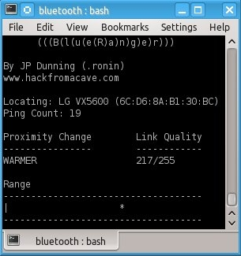

# BlueRanger
Mirror of http://www.hackfromacave.net/projects/blueranger.html, which is now
defunct, but people still use this tool. Original tool by JP Dunning (.ronin)

Description
-----------
BlueRanger is a simple Bash script which uses Link Quality to locate Bluetooth
device radios. It sends l2cap (Bluetooth) pings to create a connection between
Bluetooth interfaces, since most devices allow pings without any authentication
or authorization. The higher the link quality, the closer the device (in theory).

Use a Bluetooth Class 1 adapter for long range location detection. Switch to a
Class 3 adapter for more precise short range locating. The precision and
accuracy depend on the build quality of the Bluetooth adapter, interference, and
response from the remote device. Fluctuations may occur even when neither device
is in motion. 



Installation
------------
Installation

This script can run from any directory.

Resources:
- BlueZ
- hcitool
- l2ping

Usage
-----
Provide the local interface and Device Address of the device you are trying to locate.

```
# blueranger.sh hci0 6C:D6:8A:B1:30:BC
```

The screen will refresh after each Bluetooth Ping.

Locating: The device being located.
Ping Count: Number of L2pings sent to remote device.
Proximity Change: Updates progress from previous ping.
Link Quality: Link quality from last ping (out of 255).
Range: The * indicates the relative distance form the scanning device.

```
      (((B(l(u(e(R)a)n)g)e)r)))

By JP Dunning (.ronin)
hackfromacave.net

Locating: LG VX5600 (6C:D6:8A:B1:30:BC)
Ping Count: 19

Proximity Change        Link Quality
----------------        ------------
WARMER                  217/255

Range
------------------------------------
|                    *
------------------------------------ 
```
